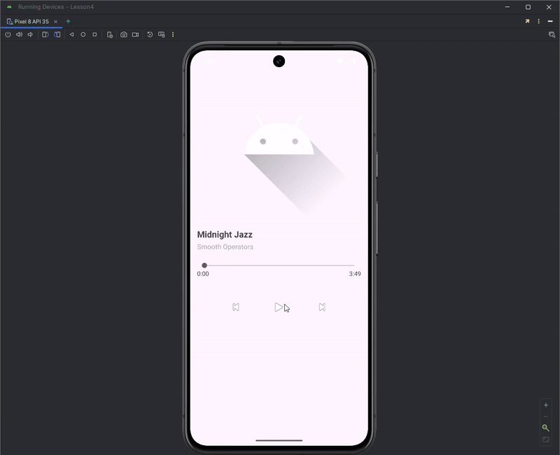

# Отчёт по практике 4

## Описание выполненных заданий

### 1. Использование ViewBinding

Была произведена замена стандартного метода инициализации графических элементов с findViewById на ViewBinding, что позволило упростить и ускорить доступ к элементам интерфейса, повысив безопасность типов данных.

### 2. Потоки и обработка данных

- Создан интерфейс для подсчета среднего количества учебных пар за указанный период. Реализовано два вида потоков: основной и фоновый. Использованы классы Handler и Looper для безопасной передачи данных из фонового потока в основной поток.
- Рассмотрена работа с методами runOnUiThread, post и postDelayed, проведён анализ порядка их выполнения и отображение этого порядка на экране устройства.
- Реализован собственный класс MyLooper для обработки сообщений и взаимодействия потоков через механизм сообщений Message и Bundle.

### 3. Работа с Loader и шифрование AES

Разработано приложение, демонстрирующее работу LoaderManager и AsyncTaskLoader. Реализовано AES-шифрование и дешифрование текста, вводимого пользователем. Зашифрованные данные и ключ передаются в Loader через Bundle, после чего Loader выполняет дешифровку и возвращает результат обратно в основной поток, где он отображается через Toast и Log.d.

### 4. Foreground-сервис для проигрывания музыки

Создано приложение с Foreground-сервисом, реализующим воспроизведение медиафайла из ресурсов приложения. Сервис корректно отображает уведомление при запуске, управляется кнопками «Play» и «Stop».

### 5. Использование WorkManager

В рамках проекта MireaProject реализован новый фрагмент, демонстрирующий работу с фоновыми задачами через механизм WorkManager. Реализован BackgroundWorker, эмулирующий длительную фоновую задачу (5 секунд), состояние которой выводится на экран. Реализовано отслеживание состояния задачи с помощью LiveData.

## Скриншоты

.png)

.png)

.png)

.png)

.png)

.png)

.png)

.png)

.png)

.png)

.png)

.png)

.png)

.png)

.png)

.png)

.png)

.png)

.png)
