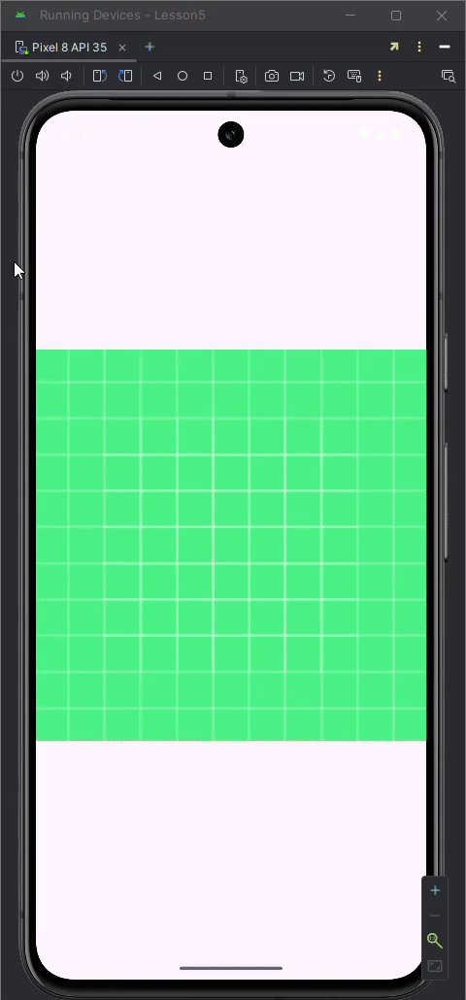
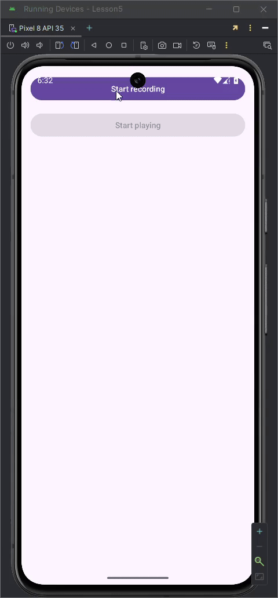
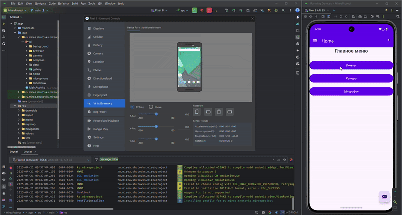

# Отчёт по практике 5

## Описание выполненных заданий

### 1. Список датчиков

Был создан экран приложения, на котором отображается полный перечень доступных датчиков устройства. Для каждого датчика указано его название и диапазон измерений.

### 2. Работа с акселерометром

Реализован отдельный модуль для отображения текущих показаний акселерометра по трём осям (X, Y, Z). Данные обновляются в реальном времени при движении смартфона.

### 3. Запрос разрешений

Реализована система запросов разрешений непосредственно в момент их использования.

### 4. Использование камеры

Разработан модуль, позволяющий запускать встроенное приложение камеры, делать фотографии, сохранять их во внутренней памяти и отображать в приложении.

### 5. Запись и воспроизведение звука

Создан интерфейс для записи аудио с помощью микрофона и последующего воспроизведения записанных файлов. Управление записью и воспроизведением осуществляется через отдельные кнопки с блокировкой одновременного выполнения действий.

### 6. Объединение модулей

Все перечисленные функции интегрированы в единый проект MireaProject. Организована удобная навигация между отдельными экранами и модулями приложения.
Реализован компас, который отображает текущее направление на экран, камера с возможностью делать фотографии и отображать их в приложении, а также модуль для записи звука.

## Скриншоты

.png)

.png)

